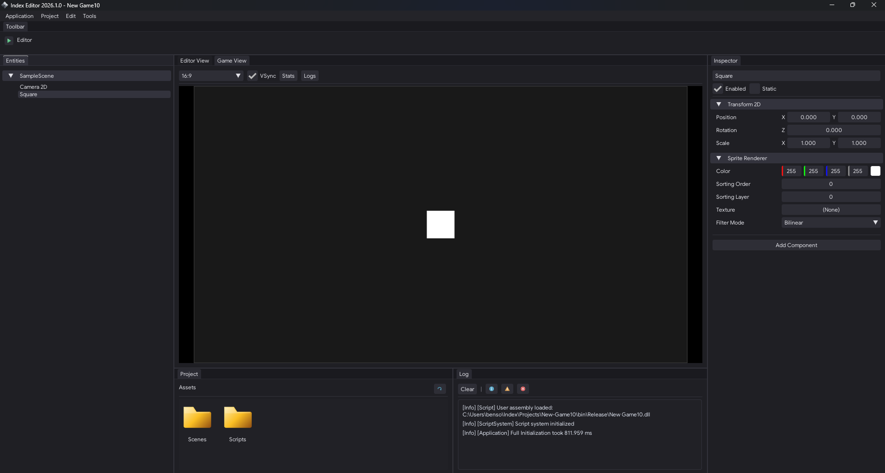
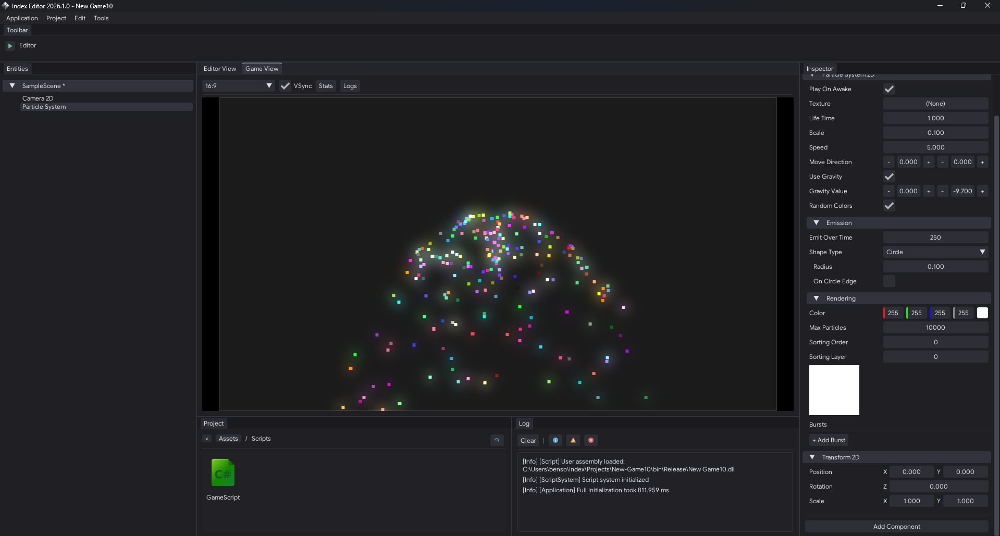
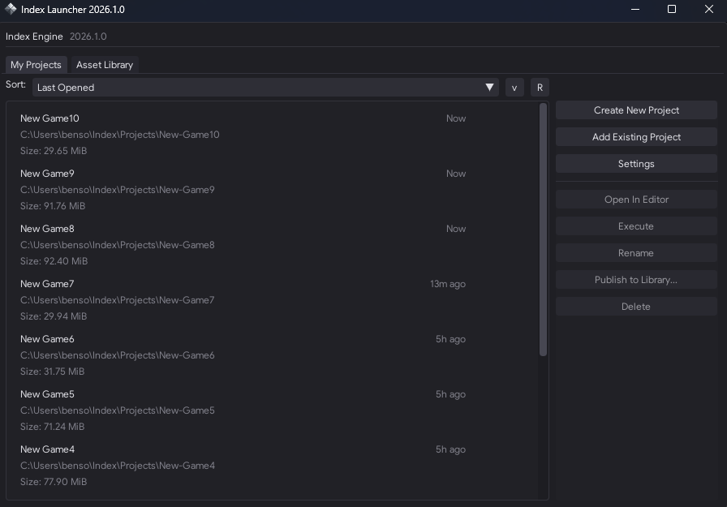
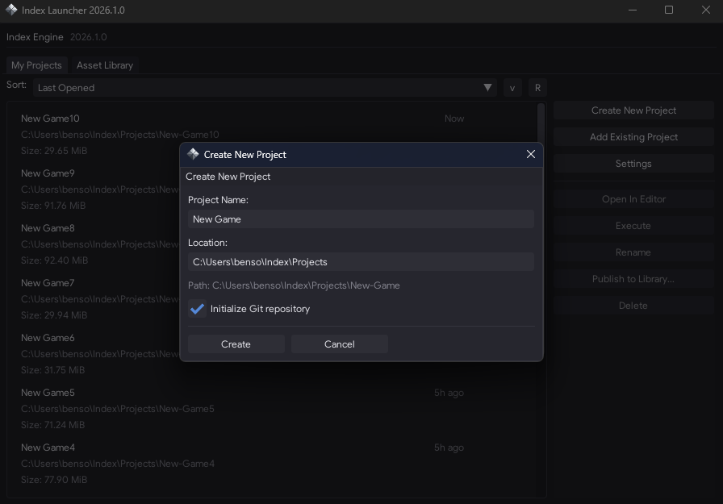

<p align="left">
 
<p align="left">

Index is a lightweight C++20 2D game engine mainly focused on performance and modularity.

## Preview

### Editor

<p align="center">
  
  
</p>

### Launcher

<p align="center">
  
  
</p>

## Getting Started

Clone with submodules:

```bash
git clone --recurse https://github.com/Ben-Scr/Index.git
cd Index
```

Then follow the steps for your platform. Re-run setup after pulling changes that touch dependencies, submodules, Premake files, or C# projects.

<details>
<summary><b>Windows (Visual Studio 2022)</b></summary>

**Prerequisites:** Visual Studio 2022 (MSVC v143 toolset + Windows SDK), .NET 9 SDK, Python 3.10+, and Git.

Generate the project files:

```bat
scripts\Setup.bat
```

Open `Index.sln` and build the configuration you want, or build from a Developer PowerShell:

```powershell
msbuild Index.sln /m /p:Configuration=Release /p:Platform=x64
```

</details>

<details>
<summary><b>Linux (GNU Make)</b></summary>

**Prerequisites:** a C++20 compiler (GCC; Dawn's source build also needs Clang), GNU Make, Python 3.10+, Git, and the GLFW + X11 development packages.

Generate the makefiles:

```bash
chmod +x scripts/Setup.sh
./scripts/Setup.sh
```

Build:

```bash
make config=release -j"$(nproc)" Index-Engine Index-Runtime Index-Editor
```

</details>

## Documentation

Guides for building games with Index live in **[`Github-Docs/Documentation`](Github-Docs/Documentation/README.md)**.

## Built With

- [WebGPU via Dawn](https://dawn.googlesource.com/dawn) — rendering (picks D3D12 / Vulkan / Metal at runtime)
- [GLFW](https://github.com/glfw/glfw) — windowing & input
- [Box2D](https://github.com/erincatto/box2d) / [Index-Physics](https://github.com/Ben-Scr/Index-Physics) — 2D physics
- [EnTT](https://github.com/skypjack/entt) — ECS
- [Miniaudio](https://github.com/mackron/miniaudio) — audio
- [GLM](https://github.com/g-truc/glm) / [STB](https://github.com/nothings/stb) — math & image loading
- [.NET 9 / hostfxr](https://dotnet.microsoft.com/) — C# scripting host


